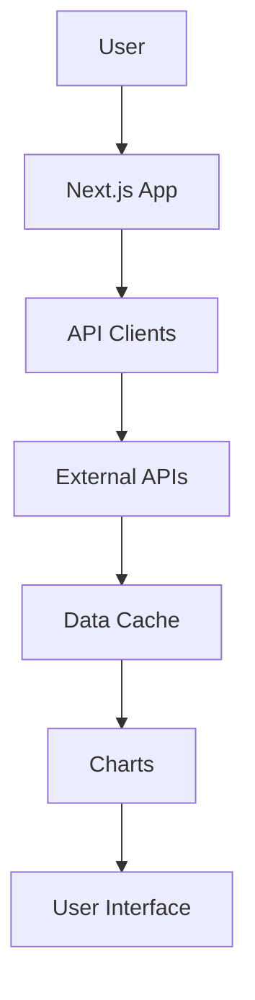

# Architecture Overview

## System Design

### 1. Frontend Architecture

```
src/
├── app/                    # Next.js app directory
│   ├── layout.tsx         # Root layout
│   ├── page.tsx           # Home page
│   └── [metric]/          # Dynamic metric pages
├── components/            # Reusable components
│   ├── charts/           # Chart components
│   ├── layout/           # Layout components
│   └── ui/               # UI components
├── lib/                  # Utility functions
│   ├── api/             # API clients
│   ├── hooks/           # Custom hooks
│   └── utils/           # Helper functions
└── types/               # TypeScript types
```

### 2. Data Flow



### 3. API Integration

#### Primary Data Sources
- **Glassnode API**
  - NUPL data
  - MVRV data
  - SOPR data
  - Rate limit: 10 requests/minute (free tier)

- **CoinGecko API**
  - Price data
  - Market data
  - Rate limit: 10-50 calls/minute (free tier)

#### Fallback Data Sources
- **CryptoCompare**
  - Price data
  - Market data
  - Rate limit: 100,000 calls/month (free tier)

- **Blockchain.info**
  - Basic blockchain data
  - Rate limit: 1 request/second

- **Messari**
  - Market data
  - Rate limit: 100 calls/minute (free tier)

### 4. Caching Strategy

#### Local Storage
- Cache API responses
- TTL: 1 hour for price data
- TTL: 24 hours for on-chain metrics
- Cache invalidation on new data

#### IndexedDB (Optional)
- Store historical data
- Enable offline functionality
- Periodic sync with API

### 5. Deployment Architecture

#### GitHub Pages
```
Repository
└── gh-pages branch
    └── static files
        ├── _next/
        ├── images/
        └── index.html
```

#### Vercel/Netlify
```
Repository
└── Production
    ├── Edge Network
    ├── Build Cache
    └── Static Assets
```

### 6. Performance Optimization

#### Build Time
- Static site generation
- Image optimization
- Code splitting
- Tree shaking

#### Runtime
- Client-side caching
- Lazy loading
- Progressive enhancement
- Service Worker (optional)

### 7. Security Considerations

#### API Security
- API keys in environment variables
- Rate limiting
- CORS configuration
- Request validation

#### Data Security
- Input sanitization
- XSS prevention
- CSRF protection
- Content Security Policy

### 8. Monitoring and Analytics

#### Performance Monitoring
- Core Web Vitals
- API response times
- Error tracking
- User metrics

#### Error Handling
- Global error boundary
- API error fallbacks
- Offline detection
- User notifications

## Development Workflow

1. **Local Development**
   - Next.js dev server
   - Hot reloading
   - TypeScript checking
   - ESLint/Prettier

2. **Testing**
   - Unit tests
   - Integration tests
   - E2E tests (optional)
   - Performance testing

3. **Deployment**
   - CI/CD pipeline
   - Preview deployments
   - Production deployment
   - Rollback capability

## Future Considerations

1. **Scalability**
   - CDN integration
   - Edge caching
   - API optimization
   - Data preloading

2. **Features**
   - More metrics
   - Custom alerts
   - User preferences
   - Export functionality

3. **Infrastructure**
   - Supabase integration
   - WebSocket support
   - PWA capabilities
   - Analytics integration 